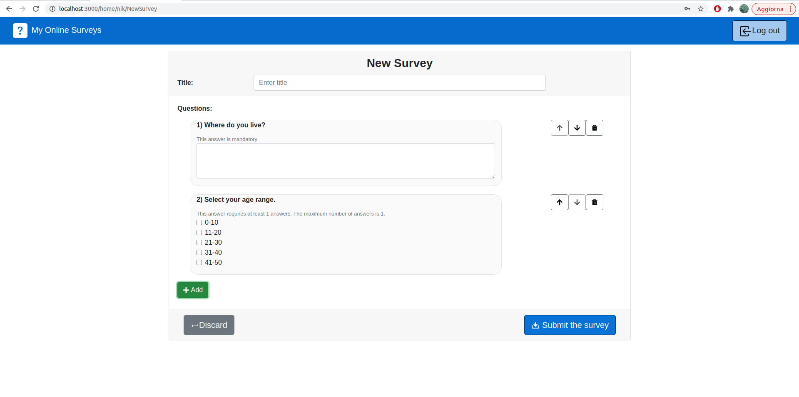

# Exam #1: "Questionario"
## Student: s287720 D'ASCENZI GIULIA 


## React Client Application Routes

- Route `/`: it shows the table of the available surveys with, for each row, a button to fill the specific survey. It can be accessed only by normal users. When a user logs-in this route redirects he/she to the admin home page.
- Route `/home/:username`: admin home page. It shows a table with all the surveys owned by the admin, a button for each survey to access the results of the specific survey and a button to create a new survey. Accessable only after logging in.
  - *username* is the username of the logged in admin.
- Route `/home/:username/newSurvey`: It shows the form to create a new survey. It can be accessed only after logging in.
  - *username* is the username of the loggedIn admin
- Route `/survey/:surveyId`: it shows the form to fill the survey with the specific surveyId (if exists). It can be accessed only by users not logged in.
  - *surveyId* is the id of the survey that the user wants to fill.

## API Server

- GET `/api/surveysInfo`
  - *description*: get the full list of surveys' informations.
  - *response body content*: array of objects, each containing information about one survey.
       ```
       [{"surveyId":1,
         "title":"Abitudini culinarie tra gli studenti italiani",
         "owner":"nik",
         "date":"2021-06-23T22:00:00.000Z"
        }]
       ```
- GET `/api/surveysQuestions`
  - *description*: get the full list of the surveys' questions.
  - *response body content*: array of objects, each containing a question of a survey.
       ```
       [{"questionId":0,
        "surveyId":1,
        "chiusa":1,
        "min":1,
        "max":1,
        "obbligatoria":0,
        "question":"A quale fascia di età appartieni?","answers":"15-20_21-25_25-30_30+"
       }]
       ```
- GET `/api/surveysAnswers`
  - *description*: get the full list of the surveys' answers that users gave to surveys owned by the logged admin.
  - *response body content*: array of objects, each containing the answers that a user gave to a survey. 
       ```
       [{"answers": "[ "0", "Liceo classico", "0", "3", "Lasagne", "0" ]",
        "surveyId":1,
        "user":"emma"}
       ```
- POST `/api/survey`
  - *description*: insert a new survey. The owner must be the logged in admin.
  - *request body content*: Description of a survey and questions belonging to the survey.
      ```
        {"title":"Raccolta differenziata a Torino",
        "owner":"nik",
        "date":"2021-06-28",
        "questions":[ {"questionId":0,
                       "surveyId":-1,
                       "chiusa":0,
                       "min":"0",
                       "max":"0",
                       "obbligatoria":1,
                       "question":"In quale quartiere abiti?",
                       "answers":""
                       },
                       {"questionId":1,
                        "surveyId":-1,
                        "chiusa":1,
                        "min":1,
                        "max":1,
                        "obbligatoria":0,
                        "question":"E' possibile svolgere facilmente la raccolta differenziata nel tuo quartiere?",
                        "answers":"Si, facilmente_Si, ma è difficile_No, non è possibile"
                        },
                        {"questionId":2,
                        "surveyId":-1,
                        "chiusa":0,
                        "min":"0",
                        "max":"0",
                        "obbligatoria":0,
                        "question":"Raccolta la tua esperienza",
                        "answers":""
                        }
                        ]
        }
    ```
  - *response body*: 
    ```
     response 200 OK: "Survey inserted correctly"
     response 400 Bad request: "Invalid parameter" or "The owner of the survey must be logged in"
     response 500: "Error inserting the survey in the db"
    ```
- POST `/api/filledSurvey`
  - *description*: insert the answers given to a survey by a user.
  - *request body content*: filled survey
      ```
        {"surveyId":37,
        "user":"gabri",
        "answers": ["San Salvario","0","La raccolta della plastica avviene porta a porta"]
        }
    ```
  - *response body*: 
    ```
     response 200 OK: "Answers inserted correctly"
     response 400 Bad request: "Invalid parameter"
     response 500: "Error inserting the answers in the db"
    ```
- POST `/api/sessions`
  - *description*:  authenticate the user who is trying to login
  - *request body*:
       ```
      {"username":"nik",
      "password":"walter123"}
      ```
  - *response body*: 
      ```
     {"id":1,
     "username":"nik"}
     ```
- DELETE `/api/sessions/current`
   - *description*: logout current user
   - *request body*: None
   - *response body*: none
- GET `/sessions/current`
   - *description*: check if current user is logged in and get her data
   - *request body*: None
   - *response body*: none 

## Database Tables

- Table `ADMINS` - contains [id username hash] of every registered admin
- Table `S_INFO` - contains [surveyId, title, owner, date] of every submitted survey
- Table `S_QUESTIONS` - contains [surveyId, questionId, chiusa, min, max, obbligatoria, question, answers ] for every question of every survey. 
  * *chiusa*: 0 if it is a open question, 1 if it is a closed question
  * *min*, *max* : minimum and maximum number of answers selectable. Have a meaning only if chiusa=1, otherwise they are not used
  * *obbligatoria*: if the answer is mandatory or not. Has a meaning only if chiusa=0, otherwise is not used
  * *question*: text of the question
  * *answers*: answers selectable. The text of the answers are concateneted by "_". Has a meaning only if chiusa=1, otherwise is not used.
- Table `S_ANSWERS` - contains [surveyId, user, answers]. Every record represents a filled survey. 
  * *answers*: vector where each i-th element contains the answer of the i-th question of the survey. The answers of the closed questions are saved concatenating the indexes of the selected answers (exemple:  "index0_index1_index2" means that the user selected the index0, index1 and index2 answers).

## Main React Components

- `MySurveyTable` (in `MySurveyTable.js`) : table that shows the available surveys. 
On every row are shown the information of a survey and there is a `MyFillInButton` that the user can click to compile that specific survey.
- `FillInSurvey` (in `FillInSurvey.js`): Form to fill a survey. It is composed of a collection of `ClosedQuestion` and `OpenQuestion`. Each question component saves internally the related answer and uses a function passed by FillInSurvey to append the answer to the other ones. Before submitting the form is validated.
- `CreateNewSurvey` (in `CreateNewSurvey.js`): It allows an admin to create a new survey. It is composed by a title input form, a list of `QuestionRow`(added questions) and a button to add a new question that shows the `AddQuestionModal`. 
- `AddQuestionModal` (in `CreateNewSurvey.js`) : modal containing the form to create a new question to be added to the survey that the admin is creating. The user check if the question is open or close, and based on this information the fields shown change. When a closed question is choose, setting the "number of answers" make appear as many answers fileds as selected, in order to make the user specify the text of each answers.
- `AdminHome` (in `AdminHome.js`) : it contains the components rendered in the home page of an admin. `AdminResults` is a table showing for each survey owned by the admin the results gotten so far. `CreateNewSurveyButton` is the button to be clicked to create a new survey.
- `SurveysResults` (in `SurveyResults.js`) : it is a modal showing a `OneSurveyResult` (filled survey) and allowing the user to move to the next (or previous) filled survey by clicking on the arrows at the end of the page.


## Screenshot



## Users Credentials

| Username     | Password    |Title of owned surveys|
| :------------| :--------:  |:--------:|
| nik          | walter123   |"Abitudini culinarie tra gli studenti italiani", "Estate 2021"|
| giulia       | ciaociao123 |"Didattica a distanza durante la pandemia","Serie tv e film"| 

